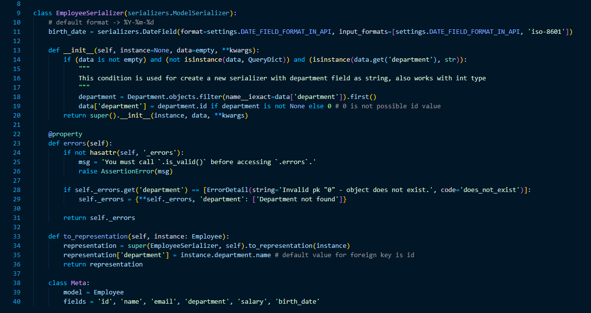

<h1>Employee-Management</h1>

<h2>🔗 Topics</h2>

<ul>

<li><a href="#about">About</a></li>
<li><a href="#tools">Tools</a></li>
<li><a href="#db">Database</a></li>
<li><a href="#project">See the project</a></li>
<ul>
    <li><a href="#routes-for-frontend">Routes for frontend</a></li>
    <li><a href="#performance">Performance</a></li>
    <li><a href="#admin">Custom admin</a></li>
</ul>
<li><a href="#project-doc">Project documentation</a></li>
<ul>
    <li><a href="#how-to-start">How to start</a></li>
    <li><a href="#how-to-use">How to use</a></li>
    <li><a href="#routes">Routes</a></li>
    <li><a href="#serializer">Serializer</a></li>
    <li><a href="#tests">Tests</a></li>
</ul>

</ul>
<br>

<h2 id="about">📖 About</h2>

<p>API for managing employees and for use with some frontend framework</p>

<br>
<h2 id="tools">🛠️ Tools</h2>

<ul>
<li>Django</li>
<li>Django Signals</li>
<li>Django Rest Framework</li>
<li>Simple JWT for authentication system</li>
<li>Fast</li>
<li>Docker</li>
<li>Docker Compose</li>
<li>Postgresql as database</li>
<li>Redis as cache</li>
</ul>

<br>
<h2 id="db">🗄️ Database</h2>
<br>

<h3>🏷️ User - main fields</h3>
<p>Used in authentication system and admin system</p>
<ul>
<li>Id</li>
<li>Username</li>
<li>Password</li>
</ul>

<br>
<h3>🏷️ Department</h3>
<ul>
<li>Id</li>
<li>Name</li>
</ul>

<br>
<h3>🏷️ Employee</h3>
<ul>
<li>Id</li>
<li>Name</li>
<li>Email</li>
<li>Department FK</li>
<li>Salary</li>
<li>Birth date</li>
</ul>

<br>
<h2 id="project">🎥 See the project</h2>
<br>

<br>
<h2 id="routes-for-frontend">🔗 Routes for frontend</h2>
<br>

<br>
<h3>• /token</h3>


<br>
<h3>• /token/refresh</h3>


<br>
<h3>• /employees</h3>


<br>
<h3>• /employees/ID</h3>


<br>
<h3>• /reports/employees/age</h3>


<br>
<h3>• /reports/employees/salary</h3>


<br>
<h2 id="performance">🚀 Performance</h2>
<p>This project has cache system using Redis</p>
<br>

<h3>Local where show load time</h3>

<br>
<h3>View</h3>


<br>
<h2 id="admin">🛡️ Custom admin system</h2>
<br>
<kbd></kbd>
<br>
<kbd></kbd>
<br>

<br>
<h2 id="project-doc">📖 Project documentation</h2>
<br>

<br>
<h2 id="how-to-start">🎓 How to start</h2>
<br>

<h3>• Make migrations</h3>

```
docker-compose run web python3 project/manage.py makemigrations
```

```
docker-compose run web python3 project/manage.py migrate
```

<h3>• Create admin user</h3>

```
docker-compose run web python3 project/manage.py createsuperuser
```


<h3>• Run project</h3>

<p>Use when create or update dependencies</p>

```
docker-compose up --build
```

<p>Usually</p>

```
docker-compose up
```

<p>Without logs</p>

```
docker-compose up -d
```

<h3>• Down project</h3>

```
docker-compose down
```

<br>
<h2 id="how-to-use">🎓 How to use</h2>
<br>

<br>
<h3>• Get your tokens in /token/</h3>

<br>

<br>

<h3>• Access any frontend router sending your access token in header</h3>

<br>


<br>
<h3>• Refresh your access token in /token/refresh/</h3>

<br>


<br>
<h2 id="routes">🔗 Routes</h2>
<br>

<ul>

<br>
<hr>
<p>POST</p>
<li>/token/</li>
<hr>

<br>
<hr>
<p>POST</p>
<li>/token/refresh/</li>
<hr>

<br>
<hr>
<p>GET | POST</p>
<li>/employees/</li>
<hr>

<br>
<hr>
<p>GET | PUT | PATCH | DELETE</p>
<li>/employees/[ID]</li>
<hr>

<br>
<hr>
<p>GET</p>
<li>/reports/employees/age/</li>
<hr>

<br>
<hr>
<p>GET</p>
<li>/reports/employees/salary/</li>
<hr>

</ul>


<br>
<h2 id="serializer">🏷️ Serializer</h2>
<br>


<br>
<h2 id="tests">🧪 Tests</h2>
<br>

<p>Usually</p>

```
docker-compose run web python3.10 project/manage.py test backend --pattern="*_t.py"
```

<p>When many changes or one change with a big impact</p>

```
docker-compose run web python3.10 project/manage.py test backend --pattern="*_t.py" --failfast
```


<h2>❌ End</h2>